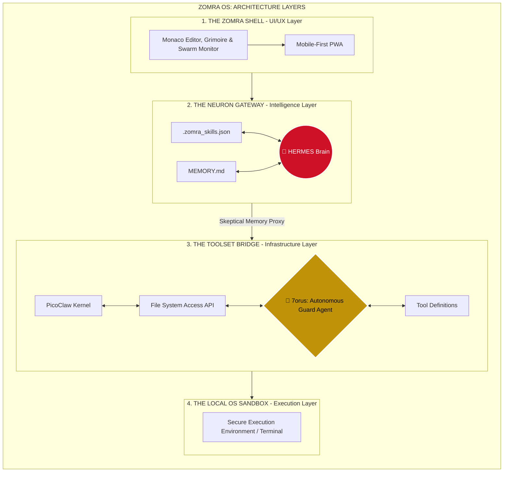

 
   𓂀
  
  # 𓂀 Zomra OS | نظام زُمرة
  
  **The Next-Generation AI-Powered Development Environment**  
  *بيئة التطوير المستقبلية المعتمدة على الذكاء الاصطناعي وسرب الوكلاء*

  
  
  
  
  
  

---

## 🌟 الرؤية (The Vision)

نظام **زُمرة (Zomra OS)** هو بيئة تطوير متكاملة تعيد تعريف مفهوم هندسة البرمجيات. تم تصميم النظام ليضع بين يديك قوة "سرب من وكلاء الذكاء الاصطناعي" (AI Swarm Agents) يعملون بتناغم تام لتحويل أفكارك إلى واقع برمجي ملموس، مع التركيز التام على الخصوصية، التعلم المستمر، والأمان.

---

## 🏗️ طبقات البنية التحتية (Architecture Layers)

تم تصميم بنية النظام الهندسية لتقديم تجربة تطوير متطورة ومستقرة، مقسمة إلى أربع طبقات رئيسية، يتصدرها **7orus** كحارس مستقل للنظام:

---

## ✨ الميزات الأساسية (Core Features)

### 🦅 7orus (Autonomous Guard Agent)
البطل الخفي وحارس النظام المستقل. يعمل `7orus` في الخلفية لمسح الاعتماديات، مراقبة صحة الكود، واعتراض الأخطاء قبل وصولها للمستخدم. هو المسؤول الأول عن تفعيل **حلقة الإصلاح الذاتي (Self-Healing Loop)** لضمان استقرار المشروع.

### 🧠 Hermes AI (الوكيل الرئيسي)
العقل المدبر للنظام. يتواصل معك بلغة طبيعية، يفهم متطلباتك المعقدة، ويقوم بكتابة وتعديل الأكواد مباشرة في مساحة عملك بناءً على توجيهاتك.

### 🔒 الخصوصية المطلقة (Absolute Privacy)
مزيج مبتكر لإدارة الذاكرة والخصوصية؛ **كل بياناتك وأكوادك تبقى على جهازك فقط**. بفضل استخدام `File System Access API` و `IndexedDB`، يتم حفظ وتعديل الملفات محلياً بالكامل. لا توجد خوادم وسيطة تخزن ملفات مشروعك، مما يوفر أقصى درجات الأمان والخصوصية لبيانات المستخدم.

### 📚 التعلم المستمر واكتساب المهارات (Continuous Learning)
هيرميس لا ينسى! يقوم النظام بتسجيل كل مهارة جديدة، خطأ تم حله، أو نمط برمجي يكتشفه في ملف `.zomra_skills.json`. هذا يعني أن النظام يعيد استخدام هذه الخبرات في المهام المستقبلية، ليصبح أذكى وأكثر تخصيصاً لأسلوبك مع كل استخدام.

### 🛡️ الذاكرة المتشككة (Skeptical Memory)
خوارزمية ذكية تتحقق من حالة الملف (Context Verification) وتقارن بين ذاكرة الذكاء الاصطناعي وحالة الملف الفعلية على القرص قبل أي عملية كتابة، مما يمنع الكتابة الخاطئة (Ghost Writes) ويحمي تعديلاتك اليدوية.

---

## 🔄 حلقة الكتابة المتشككة (The Skeptical Write Loop)

دورة حياة تنفيذ الأوامر داخل النظام تضمن الدقة والموثوقية:

```mermaid
flowchart TD
    Start([User Prompt]) --> Context[Context Retrieval]
    Context --> Compact[Context Compact: MEMORY.md & Skills]
    Compact --> Swarm[Swarm Activation: 7orus Dependencies]
    Swarm --> Phase1[Phase 1: Step 0 CLEANUP]
    Phase1 --> Phase2[Phase 2: Code Generation - Hermes]
    
    subgraph Critical [CRITICAL STEP: Skeptical Context Verification]
        Internal((Internal Memory)) <-->|VS| Disk((Disk State))
    end
    
    Phase2 --> Critical
    Critical --> Phase3[Phase 3: EXECUTION]
    Phase3 --> Phase4[Phase 4: VERIFICATION]
    Phase4 --> Update[Update MEMORY & Skills JSON]
    Update --> End([Display Output / Save])
    
    style Critical stroke:#CE1126,stroke-width:2px,fill:#1a1a1a
```

---

## 🛠️ التقنيات المستخدمة (Tech Stack)

| التقنية | الاستخدام |
|---------|-----------|
| **React 18 & TypeScript** | الواجهة الأمامية وبناء المكونات |
| **Vite** | بيئة التطوير السريعة (Build Tool) |
| **Tailwind CSS & Framer Motion** | التصميم الزجاجي (Glassmorphism) والحركات السلسة |
| **Monaco Editor** | محرر الأكواد الاحترافي (نفس محرك VS Code) |
| **Google Gemini API** | محرك الذكاء الاصطناعي (Pro & Flash) |
| **Firebase (Firestore & Auth)** | المصادقة وقواعد البيانات السحابية |
| **IndexedDB & FS Access API** | حفظ حالة مساحة العمل والوصول الآمن للملفات المحلية |

---

   
  
<b>Made with ❤️ by <a href="https://100MillionDEV.com">100MillionDEV.com</a> Copyright © 2026</b>

